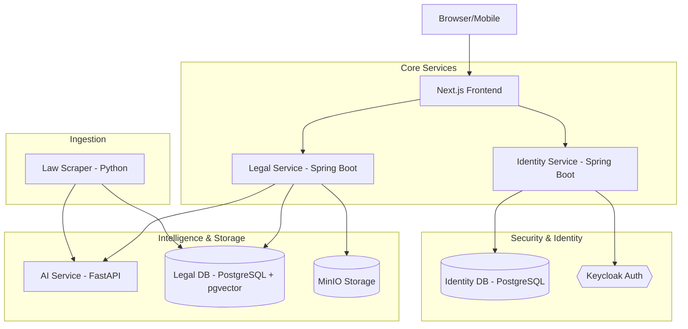
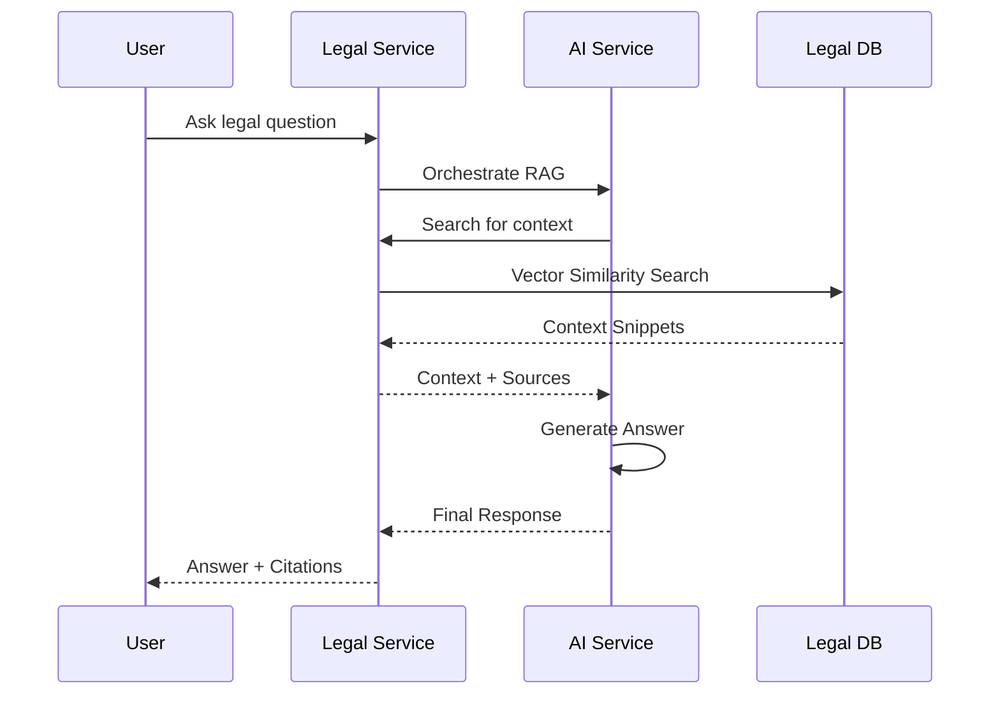

# ⚖️ Itegeko AI - Rwanda Law Navigator

[](https://github.com/ngirimana/itegeko_ai/actions)
[](https://github.com/ngirimana/itegeko_ai/actions/workflows/backend-tests.yml)
[](https://opensource.org/licenses/MIT)
[](https://github.com/ngirimana/itegeko_ai)

Itegeko AI is a production-grade legal information platform designed to make Rwanda's laws accessible through modern technology. It combines high-performance microservices, vector search, and Retrieval-Augmented Generation (RAG) to provide accurate, source-backed answers to legal queries.

---

## ✨ Key Features

- **🔍 Semantic Legal Search**: Find relevant laws using natural language, powered by `pgvector` and deep learning embeddings.
- **🤖 RAG-Powered Q&A**: Ask complex legal questions and receive answers cited directly from official legal documents.
- **🕷️ Smart Scraper**: Automated ingestion pipeline for official Rwanda Law Reform Commission (RLRC) PDFs.
- **🔐 Enterprise Identity**: Robust user management, RBAC, and audit logging via Keycloak.
- **📂 Document Management**: Integrated S3/MinIO storage for original legal texts and orders.

---

## 🏗️ Architecture

Itegeko AI uses a modular microservices architecture built for scale and reliability.

### System Landscape


### Data Flow (RAG Pipeline)
How a user query is processed and answered using source-backed legal context:



### Request Lifecycle
A typical request follows this path:
1. **Client**: User triggers an action in the Next.js UI.
2. **Frontend**: The UI validates the local session and forwards the request to the appropriate backend service.
3. **Identity Service**: Backend services validate the JWT against Keycloak to ensure the user is authorized.
4. **Business Logic**: The service processes the request, interacting with its own database or downstream services (like AI Service).
5. **Response**: Data is returned through the layers back to the user.

### 🗄️ Database Ownership
To maintain strict service boundaries, each microservice owns its own data store:

| Database | Service Owner | Storage Type | Primary Data |
| :--- | :--- | :--- | :--- |
| **Legal DB** | `legal-service` | PostgreSQL + pgvector | Laws, Articles, Vector Embeddings |
| **Identity DB** | `identity-service` | PostgreSQL | Users, Audit Logs, Activities |
| **Identity Store**| Keycloak | H2/PostgreSQL | Credentials, Client Configs, Sessions |
| **Object Store** | `legal-service` | MinIO / S3 | Raw PDF documents |

> [!TIP]
> For deep-dive technical details, sequence diagrams for all flows, and database schemas, see our [Comprehensive Architecture Documentation](docs/ARCHITECTURE.md).

---

## 🛠️ Tech Stack

| Service | Technology | Purpose |
| :--- | :--- | :--- |
| **Frontend** | Next.js 14, TailwindCSS, TypeScript | Modern, responsive user interface |
| **Legal Service** | Spring Boot 3, Hibernate, PostgreSQL | Core domain logic & document management |
| **Identity Service**| Spring Boot 3, Keycloak, JWT | Security, Auth, and Audit logs |
| **AI Service** | FastAPI, Sentence-Transformers, RAG | Vector search orchestration & AI logic |
| **Scraper** | Python, BeautifulSoup, PyMuPDF | Legal data ingestion from RLRC |
| **Infrastructure** | Docker, pgvector, MinIO, Keycloak | Containerized environment & persistence |

---

## 🚀 Getting Started

### Prerequisites
- [Docker & Docker Compose](https://docs.docker.com/get-docker/)
- [Node.js 18+](https://nodejs.org/) (for local frontend development)
- [Java 17+](https://adoptium.net/) (for local service development)

### Quick Start
1. **Clone and Setup**:
   ```bash
   git clone https://github.com/itegeko-ai/itegeko-ai.git
   cd itegeko-ai
   cp .env.example .env
   ```

2. **Launch the Stack**:
   ```bash
   npm run dev
   ```
   *This starts all services, databases, and infrastructure in Docker containers.*

3. **Access the Platform**:
   - **Frontend**: [http://localhost:3000](http://localhost:3000)
   - **Legal Service**: [http://localhost:8080](http://localhost:8080)
   - **Identity Service**: [http://localhost:8082](http://localhost:8082)
   - **AI Service**: [http://localhost:8000](http://localhost:8000)

---

## 📂 Project Structure

```text
.
├── [ai-service/](ai-service/README.md)          # FastAPI RAG & Embedding service
├── [frontend/](frontend/README.md)            # Next.js UI application
├── [identity-service/](identity-service/README.md)    # User management & Security audits
├── [legal-service/](legal-service/README.md)       # Legal document & Search domain
├── [law-scraper/](law-scraper/README.md)         # RLRC PDF ingestion scripts
├── infra/               # Keycloak realms & DB configs
├── scripts/             # Utility & testing scripts
└── docker-compose.yml   # Multi-container orchestration
```

---

## 🕷️ Law Scraper Usage

The scraper can import the full "Laws of Rwanda" tree or specific scopes.

**Run the default scraper (Companies Scope):**
```bash
docker compose run --rm law-scraper
```

**Import full "Laws in Force" tree:**
```bash
SCRAPER_SCOPE=laws-in-force SCRAPER_MAX_DOCS=0 SCRAPER_MAX_FOLDERS=0 \
  docker compose run --rm law-scraper
```

---

## 🧪 Testing & Verification

We maintain high test coverage across all services.

```bash
# Run all backend tests (Java + Python)
npm run test:backend

# Service-specific tests
cd legal-service && mvn verify
cd identity-service && mvn verify
sh scripts/test-ai.sh
```

The backend test commands mirror `.github/workflows/backend-tests.yml`. Maven `verify`
generates JaCoCo HTML reports at `legal-service/target/site/jacoco/` and
`identity-service/target/site/jacoco/`; the AI test script runs `pytest` with
coverage and writes `ai-service/coverage.xml`. Install `ai-service/requirements.txt`
and `ai-service/requirements-dev.txt` before running the Python coverage command
locally, matching the GitHub Actions setup.

---

## 📄 License

Distributed under the MIT License. See `LICENSE` for more information.

---

## 🤝 Contributing

Contributions are welcome! Please read our [Contributing Guidelines](docs/CONTRIBUTING.md) before submitting a Pull Request.

---
*Built with ❤️ for the Rwanda Legal Community.*
