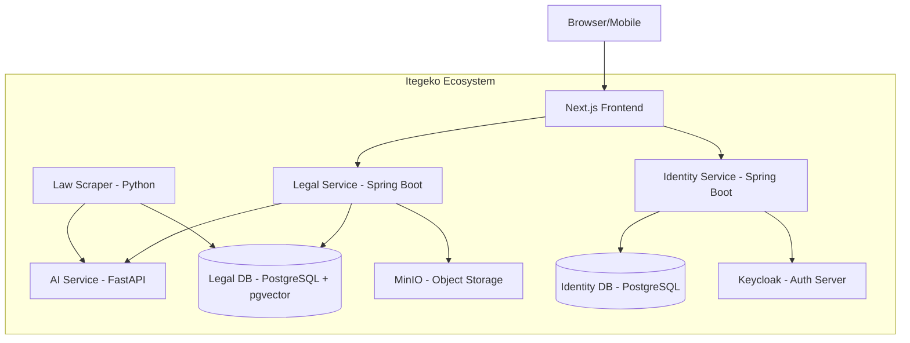
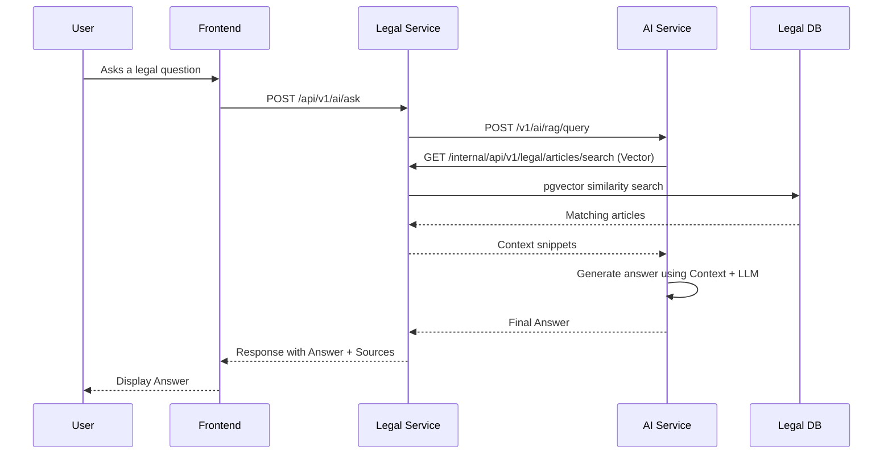
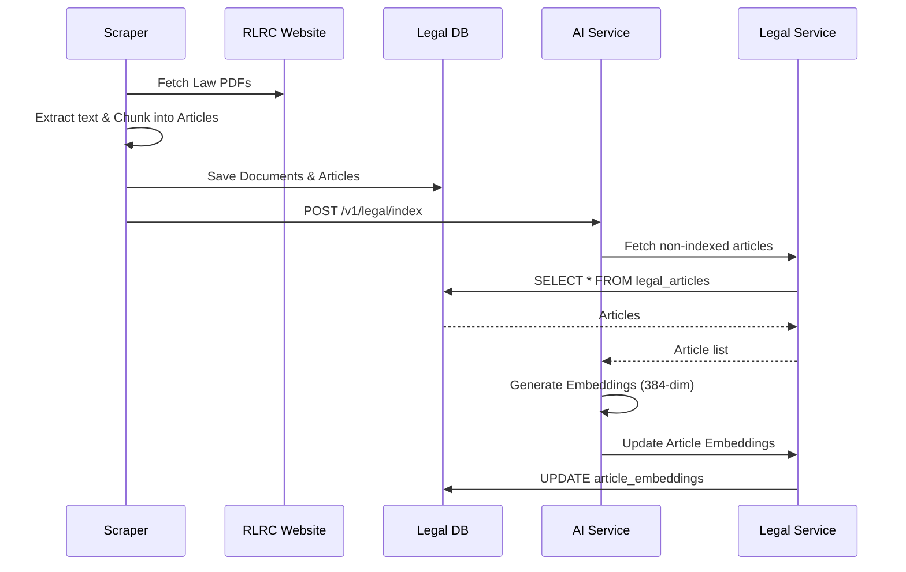

# System Architecture - Itegeko AI

This document provides a detailed deep dive into the architecture of Itegeko AI, a production-ready multi-service platform for Rwanda legal information search and RAG-backed Q&A.

## System Overview

Itegeko AI is built using a microservices architecture to ensure scalability, maintainability, and clear separation of concerns.

## Service Deep Dives

### 1. Legal Service (`legal-service`)
The core domain service managing legal content.
- **Language/Framework**: Java / Spring Boot 3.x
- **Responsibilities**:
    - Managing `LegalDocument` and `LegalArticle` entities.
    - Handling document uploads and storage in MinIO.
    - Orchestrating the RAG pipeline by calling `ai-service`.
    - Providing search capabilities using both keyword and vector similarity.
    - Managing database migrations for the legal schema.

### 2. AI Service (`ai-service`)
The intelligence layer of the platform.
- **Language/Framework**: Python / FastAPI
- **Responsibilities**:
    - Generating vector embeddings for legal articles.
    - Managing semantic search logic.
    - Orchestrating Retrieval-Augmented Generation (RAG) for Q&A.
    - Communicating with `legal-service` via internal APIs for data retrieval.
- **Key Note**: This service is stateless and does not connect directly to any database.

### 3. Identity Service (`identity-service`)
Manages users and security audits.
- **Language/Framework**: Java / Spring Boot 3.x
- **Responsibilities**:
    - User profile management.
    - Role-based Access Control (RBAC) synchronization with Keycloak.
    - Audit logging and user activity tracking.
    - Organization and membership management.

### 4. Law Scraper (`law-scraper`)
A specialized tool for data ingestion.
- **Language/Framework**: Python
- **Responsibilities**:
    - Crawling the Official RLRC (Rwanda Law Reform Commission) website.
    - Chunking PDFs into granular legal articles.
    - Hashing content to avoid duplicate imports.
    - Triggering re-indexing in the AI service after imports.

## Data Flows

### RAG Pipeline (Question & Answer)

### Ingestion Flow (Scraping & Indexing)

## Security Model

- **Authentication**: Keycloak manages all user identities and issues JWTs.
- **Authorization**:
    - Frontend uses JWT for session management.
    - Backend services validate JWTs using Keycloak's JWK Set URI.
    - RBAC is enforced at the service level (e.g., `hasRole('ADMIN')`).
- **Internal Security**: Services communicate via internal Docker networks. Sensitive endpoints (like indexing) require an `X-Internal-API-Key`.

## Database Schema

### Legal Schema
- `legal_documents`: Metadata about laws, orders, etc.
- `legal_articles`: The actual text of each article.
- `article_embeddings`: Stores `pgvector` data linked to articles.
- `scraped_legal_documents`: Tracks hashes and sources for the scraper.

### Identity Schema
- `users`: User profiles and preferences.
- `audit_logs`: Detailed tracking of system changes.
- `user_activities`: Tracks user interactions (searches, downloads).
